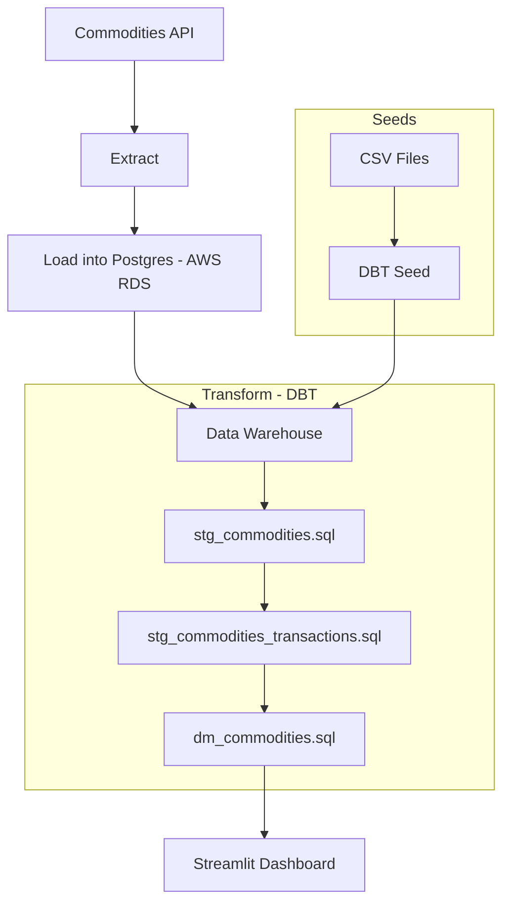

# Commodity Data Warehouse

## Overview

This project implements a modern Data Warehouse (DW) architecture designed to store and analyze commodity data. We work with an ELT architecture with Postgres and DBT. Data visualization is done with Streamlit.

### Project Steps

1. **Extract & Load**

   - Extracts data from external **Commodities API**.
   - Loads the data into **PostgreSQL** database hosted on **AWS RDS**.

2. **Seed Data**

   - Uses DBT seeds to ingest CSV files containing commodity movement data directly into the Data Warehouse.

3. **Transform (DBT Models)**

   - DBT models clean and transform data.
   - Creates **staging** and **datamart** layers in the DW.
   - SQL models: `stg_commodities.sql`, `stg_commodities_transactions.sql`, `dm_commodities.sql`.

4. **Dashboard**
   - Built using **Streamlit**.
   - Displays tables and interactive charts based on transformed data from the Data Warehouse.

---

## Project Architecture



## Technologies Used

- **Python** – for API integration and data loading
- **PostgreSQL (AWS RDS)** – as the data warehouse
- **DBT** – for data modeling and transformation
- **Streamlit** – for interactive dashboard visualization

## Getting Started

1. Run the `extract_load.py` script to populate the PostgreSQL DB with API data:

   ```bash
   python extract_load.py
   ```

2. Use dbt seed to load CSV-based seed data:

   ```bash
   dbt seed
   ```

3. Run DBT models:

   ```bash
   dbt run
   ```

4. Launch the Streamlit dashboard:
   ```bash
   streamlit run app.py
   ```

If you get any error, first **ensure that the year on the .csv files match the year we are currently on**
